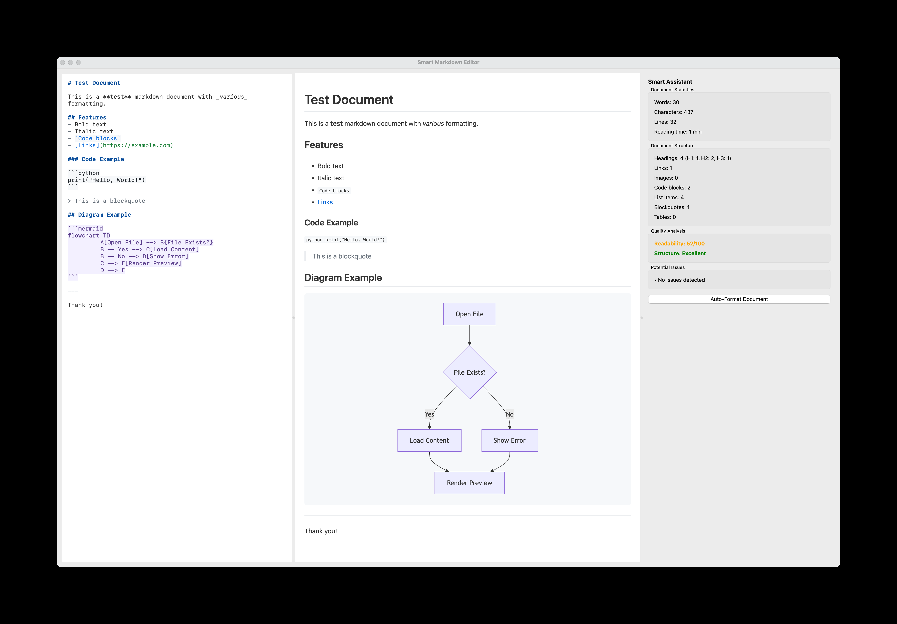

# Smart Markdown Editor

**Write better Markdown. Catch structural problems as you type. Export to 7 formats — entirely offline.**

A cross-platform desktop Markdown editor with real-time HTML preview and an integrated Smart Assistant for document quality analysis. Designed for researchers, digital humanities scholars, and technical writers who author in plain-text environments and need structural feedback — readability, heading hierarchy, issue detection — without leaving the editor or sending documents to a cloud service.

[](https://www.python.org/)
[](https://wiki.qt.io/Qt_for_Python)
[](LICENSE)
[]()
[](https://github.com/MichailSemoglou/smart-markdown-editor/actions)
[](https://doi.org/10.5281/zenodo.19328281)

## Statement of Need

Scholars who write in Markdown — the lingua franca of digital humanities project documentation, digital editions, and computational humanities research — currently have no tool that combines the structural feedback familiar from word-processor track-changes workflows with the plain-text, version-control-friendly format that modern DH and open-science practice requires.

Existing Markdown editors either provide visual previewing with no quality analysis (Typora, Obsidian), operate headlessly with no authoring context (proselint, vale), or require cloud connectivity that creates privacy and data-sovereignty concerns (Grammarly, LanguageTool). Smart Markdown Editor fills this gap: real-time structural quality feedback, inside a Markdown-native, fully offline, open-source environment — designed by a practitioner in design and digital humanities from within the community it serves.

100% local — **your documents never touch a server.**

## Features

### Core Features

- **Split-window interface**: Text editor on the left, live HTML preview on the right
- **Real-time preview**: Updates automatically as you type (300 ms debounce)
- **Syntax highlighting**: Editor highlights headings, bold, italic, code, links, and more
- **File operations**: New, Open, Save, Save As with standard keyboard shortcuts
- **Recent files menu**: Quickly reopen previously edited documents
- **Auto-save**: Periodically saves your work to prevent data loss
- **Find & Replace**: Full find and replace dialog with case-sensitive and backward search
- **Multi-format export**: Export to Markdown, Plain Text, HTML, Word (.docx), PDF, RTF, and ODT
- **Custom preview CSS**: Load any CSS file to style the live preview
- **GitHub-style rendering**: Preview styled similar to GitHub's markdown rendering
- **Cross-platform**: Windows, macOS, and Linux

### Smart Markdown Assistant

An intelligent panel that provides real-time document analysis and quality feedback.

- **Live statistics**: Word count, character count, line count, estimated reading time
- **Structure analysis**: Heading hierarchy (H1–H6), links, images, code blocks, lists, blockquotes, tables
- **Quality metrics**: Flesch-Kincaid readability score with colour-coded rating
- **Issue detection**: Flags empty links, duplicate headings, and formatting problems
- **Auto-format**: One-click formatting that adds proper heading spacing, fixes list markers, and removes excessive blank lines

## Screenshots



## Installation

```bash
# Clone the repository
git clone https://github.com/MichailSemoglou/smart-markdown-editor.git
cd smart-markdown-editor

# Create and activate a virtual environment
python3 -m venv venv
source venv/bin/activate        # macOS / Linux
# venv\Scripts\activate         # Windows

# Install dependencies
pip install -r requirements.txt

# Run the application
python markdown_editor.py
```

### Requirements

| Package     | Version  | Notes                     |
| ----------- | -------- | ------------------------- |
| Python      | ≥ 3.9    |                           |
| PySide6     | ≥ 6.8.0  | GUI framework             |
| Markdown    | ≥ 3.5.1  | Markdown processing       |
| Pygments    | ≥ 2.0    | Syntax highlighting       |
| python-docx | optional | `.docx` export            |
| reportlab   | optional | `.pdf` export (fallback)  |
| weasyprint  | optional | `.pdf` export (preferred) |
| html2text   | optional | Plain-text export         |

RTF and ODT export are built-in and require no extra libraries.

## Usage

```bash
python markdown_editor.py
```

### Keyboard Shortcuts

| Shortcut           | Action         |
| ------------------ | -------------- |
| `Cmd/Ctrl+N`       | New file       |
| `Cmd/Ctrl+O`       | Open file      |
| `Cmd/Ctrl+S`       | Save           |
| `Cmd/Ctrl+Shift+S` | Save As        |
| `Cmd/Ctrl+F`       | Find           |
| `Cmd/Ctrl+H`       | Find & Replace |
| `Cmd/Ctrl+Z`       | Undo           |
| `Cmd/Ctrl+Y`       | Redo           |
| `Cmd/Ctrl+Q`       | Quit           |

## Export Formats

| Format            | Extension | Extra dependency            |
| ----------------- | --------- | --------------------------- |
| Markdown          | `.md`     | —                           |
| Plain Text        | `.txt`    | `html2text` (optional)      |
| HTML              | `.html`   | —                           |
| Word Document     | `.docx`   | `python-docx`               |
| PDF               | `.pdf`    | `weasyprint` or `reportlab` |
| Rich Text Format  | `.rtf`    | —                           |
| OpenDocument Text | `.odt`    | —                           |

The application detects which libraries are available and shows only supported formats in the export menu.

## Project Structure

```
smart-markdown-editor/
├── markdown_editor.py         # Standalone legacy entry point
├── requirements.txt
├── README.md
├── CONTRIBUTING.md
├── CHANGELOG.md
├── LICENSE
├── src/
│   ├── main.py                # Modular entry point
│   ├── config.py              # Themes, constants, settings keys
│   ├── core/
│   │   ├── analyzer.py        # MarkdownAnalyzer — document metrics
│   │   └── highlighter.py     # MarkdownSyntaxHighlighter
│   ├── exporters/
│   │   ├── __init__.py        # Exporter registry
│   │   └── builtin.py         # All built-in exporters
│   ├── ui/
│   │   ├── main_window.py     # MainWindow (QMainWindow)
│   │   ├── assistant_panel.py # Smart Assistant side panel
│   │   ├── dialogs.py         # Find & Replace dialog
│   │   └── themes.py          # ThemeManager — stylesheets & preview HTML
│   └── utils/
│       └── __init__.py        # File and validation utilities
├── tests/
│   └── test_analyzer.py       # Unit tests for MarkdownAnalyzer
├── test_exports.py            # Integration tests for all exporters
└── .github/
    └── workflows/
        └── ci.yml             # CI pipeline (lint, type-check, test, build)
```

## Running Tests

```bash
pip install pytest pytest-cov
pytest tests/ test_exports.py -v --cov=src
```

## Technical Details

- **GUI framework**: PySide6 (Qt6)
- **Markdown processing**: Python Markdown with `codehilite`, `tables`, and `toc` extensions
- **HTML preview**: `QtWebEngineWidgets`
- **Architecture**: Modular `src/` package — core logic, UI layer, and exporters are decoupled
- **Exporter registry**: Exporters self-register; unavailable formats are hidden automatically
- **Live updates**: `QTimer`-based debounce (300 ms preview, 800 ms analysis)
- **CI**: GitHub Actions — Ruff linting, MyPy type checking, pytest on Python 3.9 and 3.12

## Citing This Software

If you use Smart Markdown Editor in your research, please cite it using the metadata in [CITATION.cff](CITATION.cff). A ready-to-paste BibTeX entry:

```bibtex
@software{semoglou_smart_markdown_editor_2026,
  author       = {Semoglou, Michail},
  title        = {Smart Markdown Editor},
  year         = {2026},
  version      = {1.0.0},
  publisher    = {Zenodo},
  doi          = {10.5281/zenodo.19328281},
  url          = {https://github.com/MichailSemoglou/smart-markdown-editor}
}
```

## Contributing

Please read [CONTRIBUTING.md](CONTRIBUTING.md) for development setup, code style guidelines, and the pull-request workflow.

## Changelog

See [CHANGELOG.md](CHANGELOG.md) for a full history of changes.

## License

This project is licensed under the MIT License — see the [LICENSE](LICENSE) file for details.

## Acknowledgments

- Built with [PySide6](https://wiki.qt.io/Qt_for_Python)
- Markdown processing by [Python Markdown](https://python-markdown.github.io/)
- Syntax highlighting powered by [Pygments](https://pygments.org/)
- Positioned within the plain-text scholarship tradition: Tenen (2017) and Healy (2019)

## Support

File an issue on the [GitHub issue tracker](https://github.com/MichailSemoglou/smart-markdown-editor/issues).
