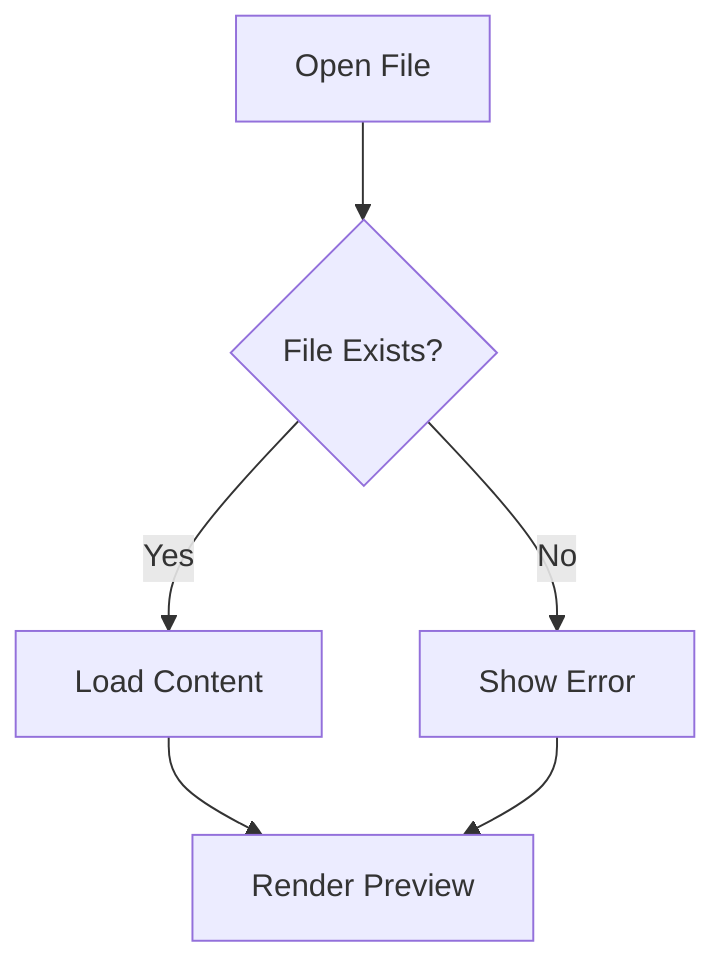

# Test Document

This is a **test** markdown document with _various_ formatting.

## Features

- Bold text
- Italic text
- `Code blocks`
- [Links](https://example.com)

### Code Example

```python
print("Hello, World!")
```

> This is a blockquote

---

## Diagram Example



---

Thank you for testing!
